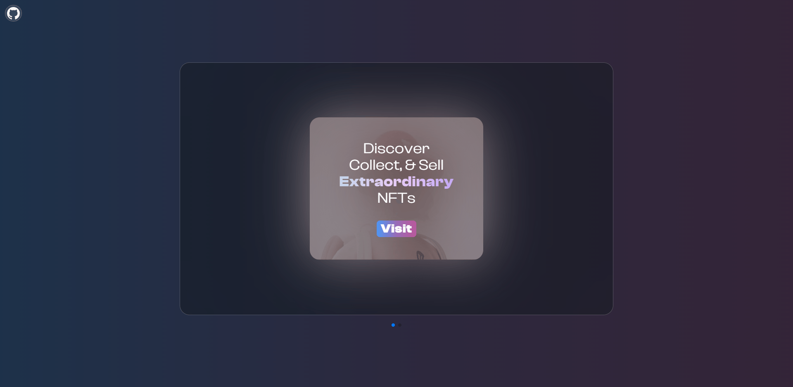
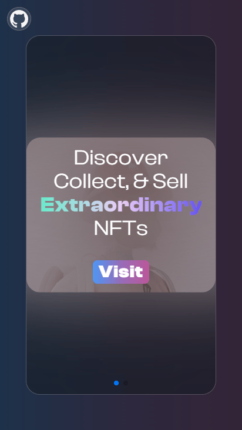

<div align="center">
  <a href="https://github.com/bastean" rel="noopener noreferrer" target="_blank">
    
  </a>
</div>

---

> Landfolio is a beautifully portfolio of landing page collections.

## Features

- **Collections**

  - Blockchain

    - ENDFT

    - B.CTech

- **PWA Support**

- **Mobile-Friendly**

## Tech Stack

- **Runtime Environment**

  - [Node.js](https://github.com/nodejs/node)

- **Build**

  - [Vite](https://www.npmjs.com/package/vite)

- **UI**

  - [React](https://www.npmjs.com/package/react)

- **Router**

  - [React Router](https://www.npmjs.com/package/react-router-dom)

- **Style**

  - [Tailwind CSS](https://www.npmjs.com/package/tailwindcss)

  - [Prettier plugin for Tailwind CSS](https://www.npmjs.com/package/prettier-plugin-tailwindcss)

  - [PostCSS](https://www.npmjs.com/package/postcss)

  - [Autoprefixer](https://www.npmjs.com/package/autoprefixer)

- **Scroll Animations**

  - [AOS](https://www.npmjs.com/package/aos)

- **Slider**

  - [Swiper](https://www.npmjs.com/package/swiper)

## Run

Install required

- [Node.js/npm](https://nodejs.org/en/download)

### Locally

Clone the repository

- HTTPS

  ```bash
  git clone https://github.com/bastean/landfolio.git
  ```

- SSH

  ```bash
  git clone git@github.com:bastean/landfolio.git
  ```

Go to the repository directory

```bash
cd landfolio/
```

Install dev/Dependencies

```bash
npm i
```

Start dev server

```bash
npm run dev
```

In the browser, go to

```http
http://localhost:5173
```

**All-In-One**

- HTTPS

  ```bash
  git clone https://github.com/bastean/landfolio.git; cd landfolio/; npm i; npm run dev;
  ```

- SSH

  ```bash
  git clone git@github.com:bastean/landfolio.git; cd landfolio/; npm i; npm run dev;
  ```

## Screenshots

<div align="center">
    <h3>Desktop</h3>
	
</div>

<div align="center">
    <h3>Mobile</h3>
	
</div>

## License

- [MIT](./LICENSE)
