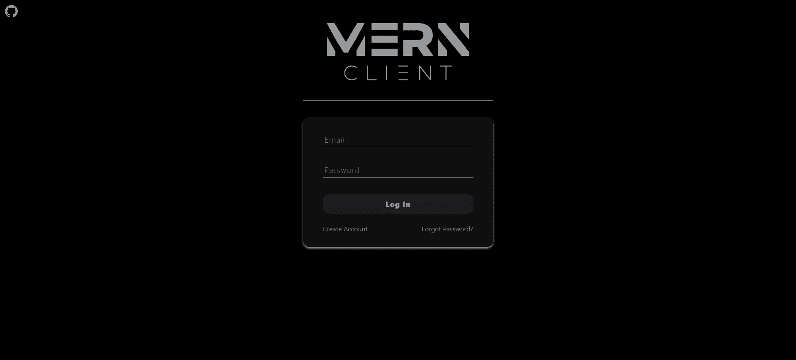
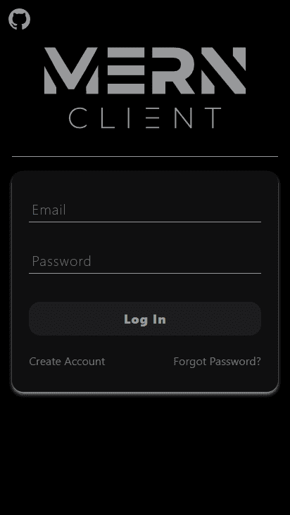

<div align="center">
  <a href="https://github.com/bastean" rel="noopener noreferrer" target="_blank">
    
  </a>
</div>

---

> MERN Client interacts with the API running on MERN Server to perform CRUD operations on users. The layout of the Client pages consists of publicly accessible pages such as Register, Email Confirm, Log In, Forgot Password, Reset Password, Terms, and the private Account page with access control.

## Features

- **Node.js**

  - Package Structure

- **Vite**

  - Environment Variables

  - Import Aliases & Directories

- **React**

  - Project Structure

- **React Router**

  - Browser Router

- **Zustand**

  - Stores

  - Middlewares

- **PostCSS**

  - Plugins

    - Tailwind CSS

    - Autoprefixer

- **Tailwind CSS**

  - Custom

    - Colors

    - Screens

- **Axios**

  - Custom Instance

  - Interceptors

    - Request

    - Response

- **PWA Support**

  - Manifest Structure

- **Netlify**

  - \_redirects

- **reCAPTCHA**

- **Mobile-Friendly**

- **README Structure**

## Tech Stack

- **Runtime Environment**

  - [Node.js](https://github.com/nodejs/node)

- **Build**

  - [Vite](https://www.npmjs.com/package/vite)

- **UI**

  - [React](https://www.npmjs.com/package/react)

- **Router**

  - [React Router](https://www.npmjs.com/package/react-router-dom)

- **State Management**

  - [Zustand](https://www.npmjs.com/package/zustand)

- **Style**

  - [Tailwind CSS](https://www.npmjs.com/package/tailwindcss)

  - [Prettier plugin for Tailwind CSS](https://www.npmjs.com/package/prettier-plugin-tailwindcss)

  - [PostCSS](https://www.npmjs.com/package/postcss)

  - [Autoprefixer](https://www.npmjs.com/package/autoprefixer)

- **reCAPTCHA**

  - [React Google reCAPTCHA](https://www.npmjs.com/package/react-google-recaptcha)

- **HTTP Client**

  - [Axios](https://www.npmjs.com/package/axios)

## Environment Variables

:warning: Before running it, you must obtain the following values to initialize the required variables.

| Variable                    | Value                                                                                       | Description                                                                                                                                                                                                           |
| :-------------------------- | :------------------------------------------------------------------------------------------ | :-------------------------------------------------------------------------------------------------------------------------------------------------------------------------------------------------------------------- |
| `VITE_SERVER_URL`           | [MERN Server](https://github.com/bastean/mern-server#locally)                               | **Required**. API base path URL on Server                                                                                                                                                                             |
| `VITE_JWT_STORED_NAME`      | String                                                                                      | **Required**. Unique key name to save JWT in Local Storage                                                                                                                                                            |
| `VITE_RECAPTCHA_PUBLIC_KEY` | [Private/Public Site Key](https://developers.google.com/recaptcha/intro#recaptcha-overview) | **Required**. Public Site Key for [React Google reCAPTCHA](https://www.npmjs.com/package/react-google-recaptcha) and Private Site Key for [MERN Server](https://github.com/bastean/mern-server#environment-variables) |

## Run

Install required

- [Node.js/npm](https://nodejs.org/en/download)

### Locally

Clone the repository

- HTTPS

  ```bash
  git clone https://github.com/bastean/mern-client.git
  ```

- SSH

  ```bash
  git clone git@github.com:bastean/mern-client.git
  ```

Go to the repository directory

```bash
cd mern-client/
```

Install dev/Dependencies

```bash
npm i
```

Add Environment Variables to `.env` file

- You must replace **"somevalue"** with your own values.

```bash
echo $'VITE_SERVER_URL=somevalue\n\nVITE_JWT_STORED_NAME=somevalue\n\nVITE_RECAPTCHA_PUBLIC_KEY=somevalue' >> .env
```

Clear Bash History

```bash
history -cw
```

Start dev server

```bash
npm run dev
```

In the [MERN Server](https://github.com/bastean/mern-server#environment-variables), add to `CLIENT_URL`

```http
http://localhost:5173
```

**All-In-One**

- HTTPS

  ```bash
  git clone https://github.com/bastean/mern-client.git; cd mern-client/; npm i; echo $'VITE_SERVER_URL=somevalue\n\nVITE_JWT_STORED_NAME=somevalue\n\nVITE_RECAPTCHA_PUBLIC_KEY=somevalue' >> .env; history -cw; npm run dev;
  ```

- SSH

  ```bash
  git clone git@github.com:bastean/mern-client.git; cd mern-client/; npm i; echo $'VITE_SERVER_URL=somevalue\n\nVITE_JWT_STORED_NAME=somevalue\n\nVITE_RECAPTCHA_PUBLIC_KEY=somevalue' >> .env; history -cw; npm run dev;
  ```

## Screenshots

<div align="center">
    <h3>Desktop</h3>
	
</div>

<div align="center">
	<h3>Mobile</h3>
    
</div>

## License

- [MIT](./LICENSE)
