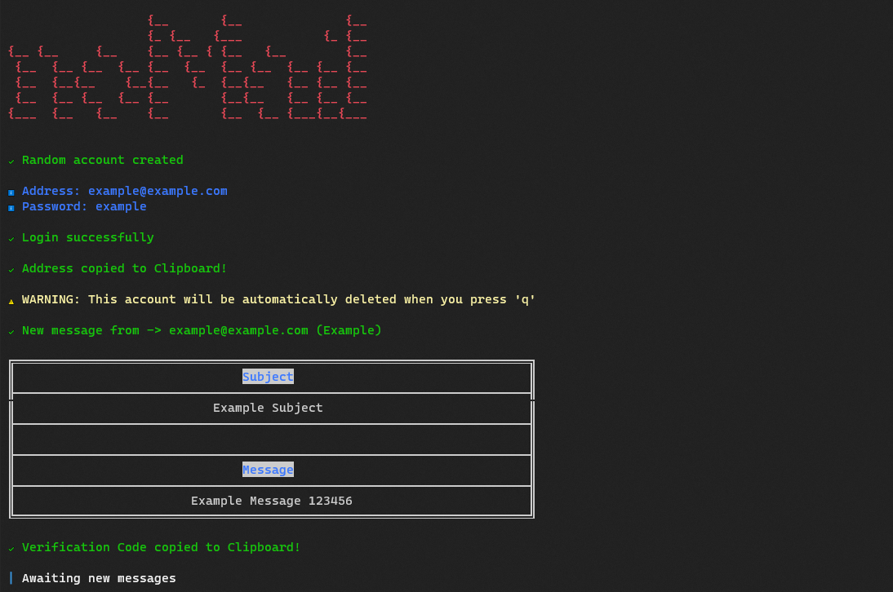

<div align="center">
  <a href="https://github.com/bastean" rel="noopener noreferrer" target="_blank">
    
  </a>
</div>

---

> No Mail? No Problem. Generate random addresses for email confirmations and detect verification codes automatically from the command-line.

## Screenshots

<div align="center">
	
</div>

## Run

Install required

- [Node.js/npm/npx](https://nodejs.org/en/download)

### npx

Start CLI

```bash
npx nomail
```

### npm

Install package globally

```bash
npm i -g nomail
```

Start CLI

```bash
nomail
```

### Locally

Clone the repository

- HTTPS

  ```bash
  git clone https://github.com/bastean/nomail.git
  ```

- SSH

  ```bash
  git clone git@github.com:bastean/nomail.git
  ```

Go to the repository directory

```bash
cd nomail/
```

Install dev/Dependencies

```bash
npm i
```

Create global symlink

```bash
npm link
```

Start CLI

```bash
nomail
```

**All-In-One**

- HTTPS

  ```bash
  git clone https://github.com/bastean/nomail.git; cd nomail/; npm i; npm link; nomail;
  ```

- SSH

  ```bash
  git clone git@github.com:bastean/nomail.git; cd nomail/; npm i; npm link; nomail;
  ```

## CLI Reference

### Index

1. [Usage](#usage)

2. [Global Options](#2-global-options)

   2.1. [version](#21-version)

   2.2. [help](#22-help)

## 1. Usage

- ### Synopsis

  ```bash
  nomail [options]
  ```

## 2. Global Options

## 2.1. version

- ### Synopsis

  ```bash
  nomail [options]
  ```

- ### Options

  - **-V, --version**

    - Output the version number

## 2.2. help

- ### Synopsis

  ```bash
  nomail [options]
  ```

- ### Options

  - **-h, --help**

    - Display help for command

## Tech Stack

- **Runtime Environment**

  - [Node.js](https://github.com/nodejs/node)

- **CLI**

  - [Commander.js](https://www.npmjs.com/package/commander)

- **Clipboard Access**

  - [clipboardy](https://www.npmjs.com/package/clipboardy)

- **Text Table**

  - [Table](https://www.npmjs.com/package/table)

- **Colors & Styles**

  - [Colors.js](https://www.npmjs.com/package/colors)

- **Spinners**

  - [ora](https://www.npmjs.com/package/ora)

- **ASCII Art**

  - [FIGlet](https://www.npmjs.com/package/figlet)

- **API Wrapper ([Mail.tm](https://docs.mail.tm/))**

  - [Mailjs](https://www.npmjs.com/package/@cemalgnlts/mailjs)

- **Automatic Restart**

  - [nodemon](https://www.npmjs.com/package/nodemon)

## License

- [MIT](./LICENSE)
