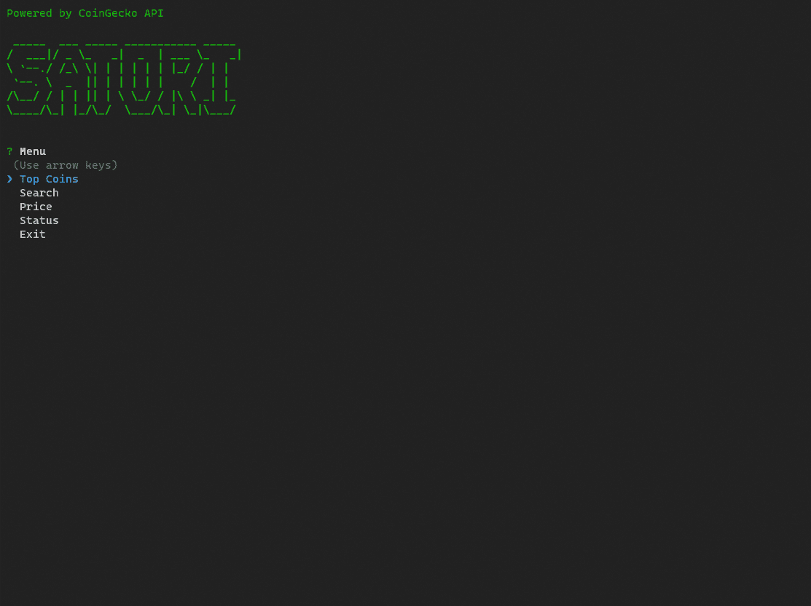
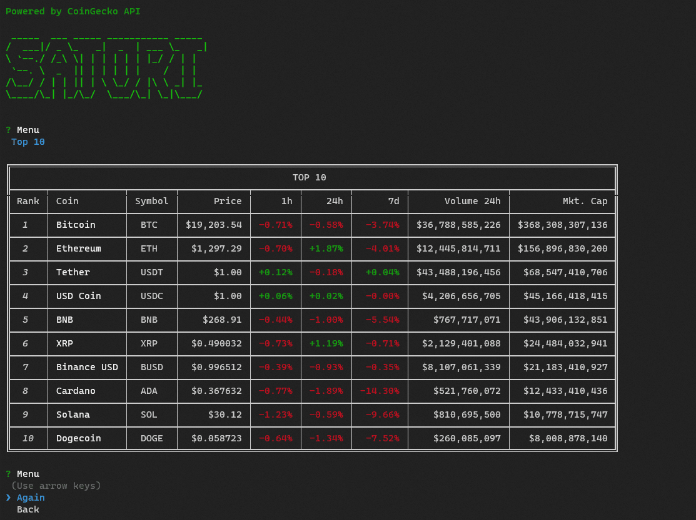
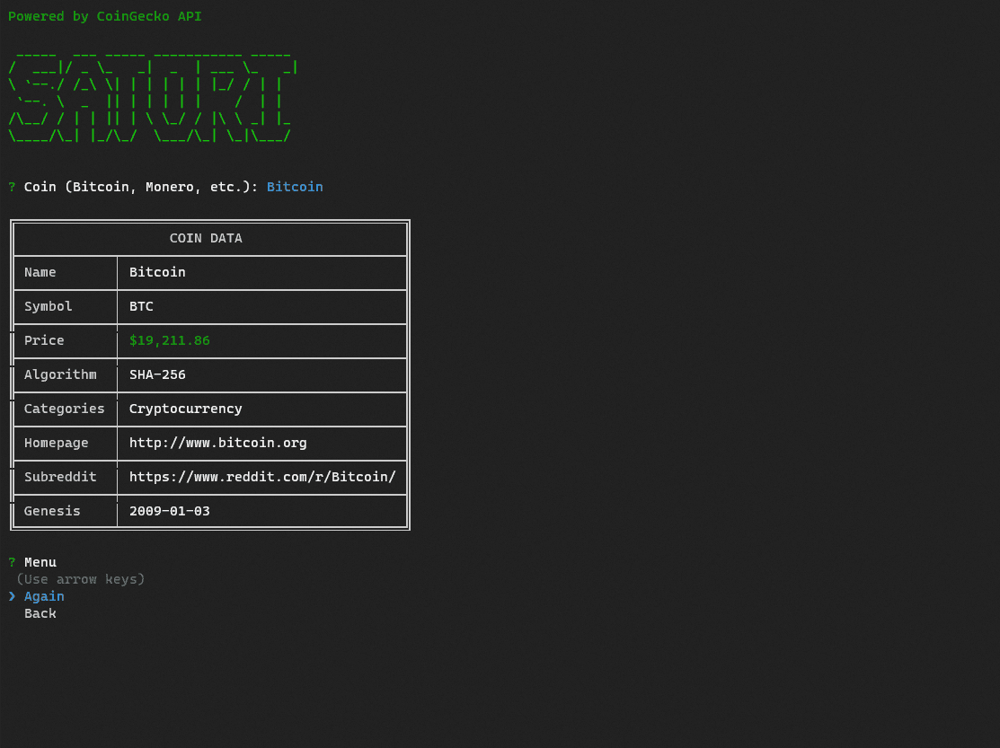
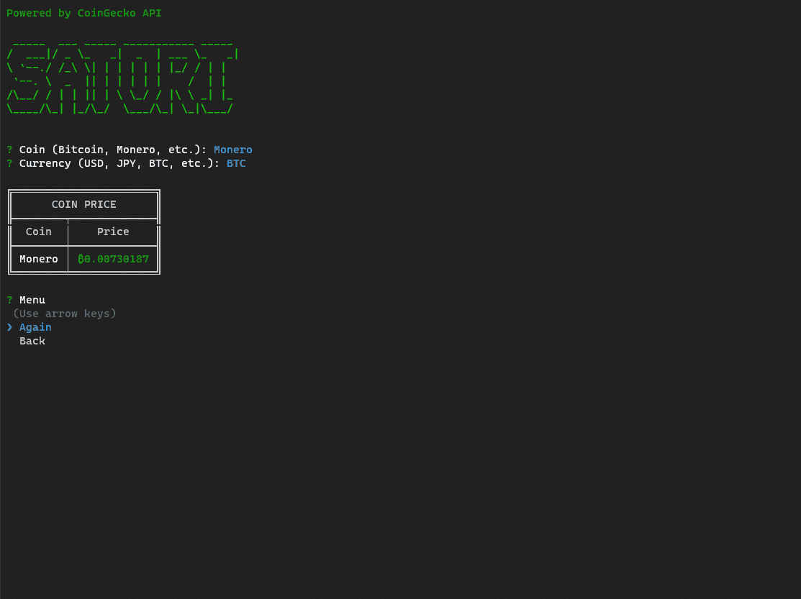
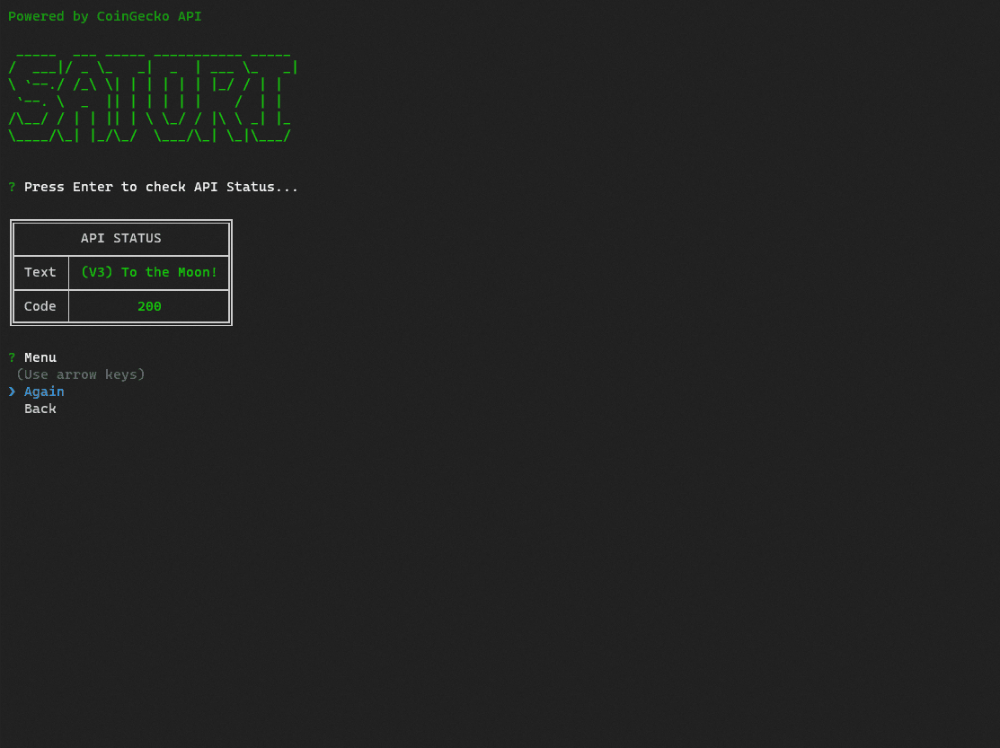

<div align="center">
  <a href="https://github.com/bastean" rel="noopener noreferrer" target="_blank">
    
  </a>
</div>

---

> Satori allows you to obtain information in order to understand the present crypto market directly from the command-line and through an interactive interface, all information is obtained through the CoinGecko API.

## Features

- **Top Coins**

  - 10, 50 & 100

- **Search coin data**

  - Bitcoin, Monero, etc.

- **Obtain coin price**

  - USD, JPY, BTC, etc.

- **Check API Status**

## Tech Stack

- **Runtime Environment**

  - [Node.js](https://github.com/nodejs/node)

- **CLI**

  - [Commander.js](https://www.npmjs.com/package/commander)

- **Interactive CLI**

  - [Inquirer.js](https://www.npmjs.com/package/inquirer)

- **Text Table**

  - [Table](https://www.npmjs.com/package/table)

- **Format Crypto & Fiat**

  - [Cryptoformat](https://www.npmjs.com/package/@coingecko/cryptoformat)

- **Colors & Styles**

  - [Colors.js](https://www.npmjs.com/package/colors)

- **ASCII Art**

  - [FIGlet](https://www.npmjs.com/package/figlet)

- **HTTP Client**

  - [Axios](https://www.npmjs.com/package/axios)

- **Automatic Restart**

  - [nodemon](https://www.npmjs.com/package/nodemon)

- **API**

  - [CoinGecko API](https://www.coingecko.com/en/api)

## Run

Install required

- [Node.js/npm/npx](https://nodejs.org/en/download)

### npx

Start Interactive CLI

```bash
npx satori-cli
```

### npm

Install package globally

```bash
npm i -g satori-cli
```

Start Interactive CLI

```bash
satori-cli
```

### Locally

Clone the repository

- HTTPS

  ```bash
  git clone https://github.com/bastean/satori-cli.git
  ```

- SSH

  ```bash
  git clone git@github.com:bastean/satori-cli.git
  ```

Go to the repository directory

```bash
cd satori-cli/
```

Install dev/Dependencies

```bash
npm i
```

Create global symlink

```bash
npm link
```

Start Interactive CLI

```bash
satori-cli
```

**All-In-One**

- HTTPS

  ```bash
  git clone https://github.com/bastean/satori-cli.git; cd satori-cli/; npm i; npm link; satori-cli;
  ```

- SSH

  ```bash
  git clone git@github.com:bastean/satori-cli.git; cd satori-cli/; npm i; npm link; satori-cli;
  ```

## CLI Reference

### Index

1. [Usage](#usage)

2. [Global Options](#2-global-options)

   2.1. [version](#21-version)

   2.2. [help](#22-help)

3. [Commands](#3-commands)

   3.1. [interactive](#31-interactive)

   3.2. [top](#32-top)

   3.3. [search](#33-search)

   3.4. [price](#34-price)

   3.5. [status](#35-status)

   3.5. [help](#36-help)

## 1. Usage

- ### Synopsis

  ```bash
  satori-cli [options] [command]
  ```

## 2. Global Options

## 2.1. version

- ### Synopsis

  ```bash
  satori-cli [options]
  ```

- ### Options

  - **-V, --version**

    - Output the version number

## 2.2. help

- ### Synopsis

  ```bash
  satori-cli [options]
  ```

- ### Options

  - **-h, --help**

    - Display help for command

## 3. Commands

## 3.1. interactive

- ### Description

  - Start Interactive CLI **(Default Command)**

- ### Synopsis

  ```bash
  satori-cli [options]
  ```

  ```bash
  satori-cli interactive [options]
  ```

- ### Options

  - [help](#22-help)

## 3.2. top

- ### Description

  - Top Coins: 10, 50 & 100

- ### Synopsis

  ```bash
  satori-cli top [options]
  ```

- ### Options

  - **-10**

    - Top 10 Coins

  - **-50**

    - Top 50 Coins

  - **-100**

    - Top 100 Coins

  - [help](#22-help)

## 3.3. search

- ### Description

  - Search coin data

- ### Synopsis

  ```bash
  satori-cli search [options] <coinId>
  ```

- ### Arguments

  - **coinId**

    - Bitcoin, Monero, etc.

- ### Options

  - [help](#22-help)

## 3.4. price

- ### Description

  - Obtain coin price

- ### Synopsis

  ```bash
  satori-cli price [options] <coinId> <currency>
  ```

- ### Arguments

  - **coinId**

    - Bitcoin, Monero, etc.

  - **currency**

    - USD, JPY, BTC, etc.

- ### Options

  - [help](#22-help)

## 3.5. status

- ### Description

  - Check API Status

- ### Synopsis

  ```bash
  satori-cli status [options]
  ```

- ### Options

  - [help](#22-help)

## 3.6. help

- ### Description

  - Display help for command

- ### Synopsis

  ```bash
  satori-cli help [command]
  ```

- ### Commands

  - [Commands](#3-commands)

## Screenshots

### Interactive CLI

<div align="center">
	
    
    
    
    
</div>

## License

- [MIT](./LICENSE)
